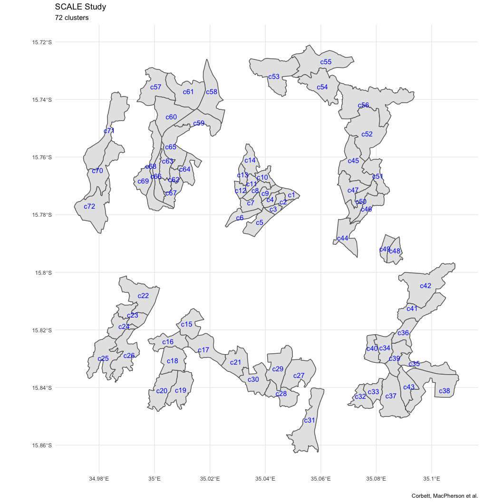

<!-- README.md is generated from README.Rmd. Please edit that file -->

# mlwdata: a repository of datasets for MLW population health in Malawi

<!-- badges: start -->

<!-- badges: end -->

`mlwdata` contains a set of annotated datasets that have been collected
as part of research studies conducted at the Malawi-Liverpool-Wellcome
Trust Clinical Research Programme in Blantyre, Malawi.

The main aims are to:

  - Ensure consistent use of data between and within studies over time
  - Facilitate sharing of data to reduce duplication of efforts

## Installation

You can install the from [GitHub](https://github.com/) with:

``` r
# install.packages("devtools")
devtools::install_github("petermacp/mlwdata")
```

<br>

## Datasets

Currently, the following datasets are available:

**scale\_72\_clusters** <br> A `sf` MULTIPOLYGON object, containing
polygon boundaries and cluster IDs for the SCALE Study, with variables:

  - `cluster`: unique identifier for each of the 72 study clusters
  - `geometery`: a list column, containing polygons for each cluster
    boundary.

<br>

**blantyre\_clinics** <br> A `sf` POINT object, containing coordinates
for Blantyre clinics/hospitals, and clinic IDs:

  - `clinic`: unique name of each of the 18 clinics/hospitals
  - `geometry`: a list column, containing points for each
    clinic/hospital.

<br>

**blantyre\_census\_2008\_2018** <br> A `tibble`, containing age, sex
and district-stratfied (Blantyre City, Blantyre Rural) population
estimates from the 2008 and 2018 Malawi National Census. These data were
provided by the Malwai National Statistics Office in October 2019.

  - `District`: either Blantyre City, or Blantyre Rural (as classified
    in the Census)
  - `Year`: census year (2008 or 2018)
  - `Age`: age group of population estimates
  - `Total`: total population
  - `Male`: Male population
  - `Female`: Female population

<br>

**blantyre\_tb\_cases\_2009\_2018** <br> A `tibble`, containing numbers
of TB cases notified in Blantyre TB registration centres between Q1 2009
and Q4 2018 by quarter, and stratified by active case finding area of
the city (ACF vs. non-ACF), and microbiological status of cases

  - `year_q`: Annual quarter
  - `acf`: Area of Blantyre City (`ACF` = received active case finding
    intervention; `non-ACF` = didn’t receive active case finding
    intervention)
  - `tbcases`: Classification of TB diagnosis (`Smr/Xpert-positive`
    cases = cases that were either smear or xpert positive in testing by
    the routine clinic programme, or smear-positive by the research TB
    lab; `All cases` = all cases started on treatment, regardless of
    microbiological status)
  - `n`: number of cases in category

<br>

**blantyre\_tb\_cases\_2009\_2018** <br> A `tibble`, containing
anonymised individual-level TB cases notified in Blantyre TB
registration centres between Q1 2011 and Q4 2018

  - `unique_id`: Anonymised unique case ID
  - `fac_code`: TB registration centre
  - `reg_date`: Date on which TB case was registered for treatment
  - `year`: Year of registration for TB treatment
  - `quarter`: Quarter of registration for TB treatment
  - `year_q`: Year and quarter of TB treatment registration
  - `period`: Active case finding intervention period (`pre-ACF` =
    before ACF implemented; `ACF` = during ACF intervention; `post-ACF`
    = after ACF intervention implemented)
  - `sex`: Sex of TB case (male or female)
  - `age`: Age of TB case on day of treatment registration
  - `agegp`: Age group of TB case (`1`= 0-4 years, `2`= 5-14 years, `3`=
    15+ years)
  - `acf`: Whether TB case’s household was located in the ACF
    intervention area of Blantyre City (`ACF`), or the non-ACF area of
    Blantyre City `Non-ACF`
  - `hiv`: HIV status of the TB case at TB treatment registration
  - `art`: Was patient taking antiretroviral therapy for the treatment
    of HIV at the start of TB treatment?
  - `smr_clinic`: Sputum smear status of TB case at TB registration,
    from sample collected and tested by the routine health system
  - `smr_lab`: Sputum smear status of TB case at TB registration, from
    sample collected at treatment registration, and tested in the
    research TB lab at the College of Medicine, University of Malawi
  - `xpert_clinic`: Sputum Xpert status of TB case at TB registration,
    from sample collected and tested by the routine health system. Note
    that Xpert was only reliably introduced into the programme from Q2
    2015 onwards
  - `tbtype`: Classified as either `Pulmonary TB` or `Extrapulmonary TB`
  - `cgh_dur`: Duration of cough (in weeks) prior to TB treatment
    registration
  - `tb_cat`: Category of TB patient (`New`, `Relapse`, `Retreatment
    after default`, `Retreatment after failure`, `Other`)
  - `smr_any`: Whether a positive sputum smear result was obtained from
    either the routine health system or the study research lab sample
  - `smr_xpert_any`: Whether a positive sputum smear result was obtained
    from either the routine health system or the study research lab
    sample, or a positive Xpert result was obtained from the routine
    health system.

<br>

**acf\_cnrs\_overall** <br> A `tibble`, containing TB case notification
rates (all cases) per 100,000 population between Q1 2009 and q4 2018,
stratifed by active case finding intervention area

  - `year_q`: Annual quarter
  - `acf`: Whether TB case’s household was located in the ACF
    intervention area of Blantyre City (`ACF`), or the non-ACF area of
    Blantyre City `Non-ACF`
  - `cases`: Number of registered TB cases per category
  - `tbcases`: Classification of TB cases (microbiologically-confirmed
    or all cases)
  - `population`: Total population per strata
  - `q_population`: Total population per strata/4 (for CNR estimates)
  - `cnr`: TB case notification rate, per 100,000 per strata
  - `conf.low`: Lower bound of CNR 95% confidence interval
  - `conf.high`: Upper bound of CNR 95% confidence interval
  - `period`: Active case finding intervention period (`pre-ACF` =
    before ACF implemented; `ACF` = during ACF intervention; `post-ACF`
    = after ACF intervention implemented)

<br>

**acf\_smrpos\_cnrs\_overall** <br> A `tibble`, containing TB case
notification rates (smear or xpert-positive cases) per 100,000
population between Q1 2009 and q4 2018, stratifed by active case finding
intervention area. Note cases are classified as Smear/Xpert positive if
a positive sputum smear result was obtained from either the routine
health system or the study research lab sample, or a positive Xpert
result was obtained from the routine health system.

  - `year_q`: Annual quarter
  - `acf`: Whether TB case’s household was located in the ACF
    intervention area of Blantyre City (`ACF`), or the non-ACF area of
    Blantyre City `Non-ACF`
  - `cases`: Number of registered TB cases per category
  - `tbcases`: Classification of TB cases (microbiologically-confirmed
    or all cases)
  - `population`: Total population per strata
  - `q_population`: Total population per strata/4 (for CNR estimates)
  - `cnr`: TB case notification rate, per 100,000 per strata
  - `conf.low`: Lower bound of CNR 95% confidence interval
  - `conf.high`: Upper bound of CNR 95% confidence interval
  - `period`: Active case finding intervention period (`pre-ACF` =
    before ACF implemented; `ACF` = during ACF intervention; `post-ACF`
    = after ACF intervention implemented)

<br>

## Examples

The SCALE Study defined 72 geographical cluster boundaries in urban
Blantyre using GPS waypaths. These clusters can be loaded and plotted:

``` r
library(mlwdata)
library(tidyverse)

glimpse(scale_72_clusters)
#> Observations: 72
#> Variables: 2
#> $ cluster  <chr> "c1", "c2", "c3", "c4", "c5", "c6", "c7", "c8", "c9", "…
#> $ geometry <list> [35.05040, 35.05040, 35.05040, 35.05040, 35.05040, 35.…


ggplot(scale_72_clusters) +
  geom_sf() +
  geom_sf_text(aes(label=cluster), colour="blue") +
  theme_minimal() +
  labs(title="SCALE Study",
       subtitle="72 clusters",
       x="",
       y="",
       caption = "Corbett, MacPherson et al.")
```



We could add on the location of the clinics in Blantyre.

``` r

library(sf)
library(ggrepel)

qech <- blantyre_clinics %>%
  #filter to show QECH only for interest
  filter(clinic=="Queen Elizabeth hospital") %>%
  #split out the x and y coordinates to allow use of ggrepel
  st_coordinates() %>%
  as_tibble() %>%
  mutate(clinic="QECH")

ggplot() +
  geom_sf(data = scale_72_clusters) +
  geom_sf_text(data = scale_72_clusters, aes(label=cluster), colour="blue") +
  geom_sf(data=blantyre_clinics, shape=17, colour="#22211d") +
  geom_label_repel(data = qech, 
                       aes(x=X, y=Y, label=clinic), 
        fontface = "bold",
        min.segment.length = 0) +
  theme_minimal() +
  labs(title="SCALE Study",
       subtitle="72 clusters. Clinics/hospitals labelled with triangles",
       x="",
       y="",
       caption = "Corbett, MacPherson et al.") +
  coord_sf()
```


